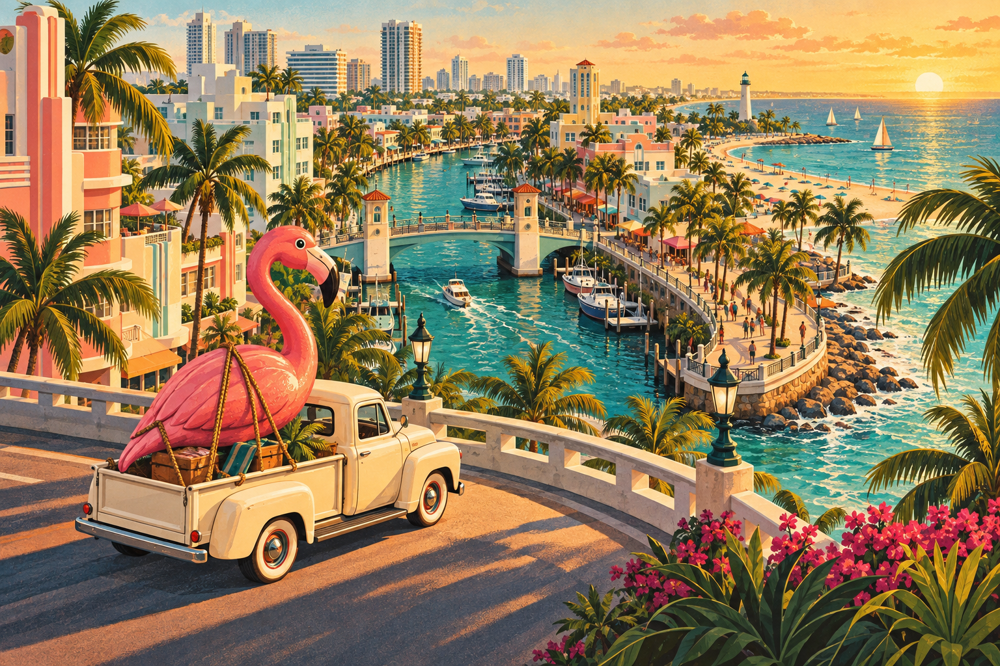

# POSTCARD PANIC

> **A getaway plan you can mail.** Draw a cyan escape route on a tourist postcard, then watch your exact ink become a miniature coastal chase.

[Play the live game](https://postcard-panic-anmol.anmolpatel2112.chatgpt.site) · [Browse the source](https://github.com/Xenon010101/postcard-panic)

POSTCARD PANIC is an original, GTA VI-inspired browser experience built for the **Build with React Image Editor Challenge**. The crew has an oversized flamingo, a pickup truck, and 48 seconds to reach a boat. The postcard is the plan: its saved pixels determine where the truck drives, whether the patrol catches it, and whether the boat is still waiting.



## Why the editor matters

This is not a decorative image-editing step. The project uses the real [Unlayer React Image Editor](https://github.com/unlayer/react-image-editor) as the route-planning surface:

1. Draw a single cyan (`#00D8FF`) line through the street map from pickup **A** to boat **B**.
2. Save the edited image from the editor.
3. Sample its actual pixels against the district street graph.
4. Turn the recognized route into a deterministic escape simulation and city replay.

Every exported postcard is a playable plan. Importing the same original PNG reproduces the same route and outcome.

## What’s inside

- A real React Image Editor workflow with save, cancel, reset, validation, and clear drawing guidance.
- Tolerant cyan-pixel route recognition that explains gaps, branches, loops, and missing endpoints.
- A deterministic chase: a timed drawbridge, marina patrol window, slower boardwalk, and 48-second boat departure.
- A Three.js miniature Palmetto Bay reveal with a top-down fallback for unavailable WebGL.
- **Postcard Intelligence**: route codename, risk score, timing advisories, and simulator-verified recovery suggestions.
- Account-free local progress, muted-by-default sound, reduced-motion support, PNG import/export, and responsive controls.

## Run locally

Requires Node.js 22.12 or newer (Node 24 recommended).

```sh
npm ci
npm run dev
```

Open the local address shown by Vite. No account or API key is required. The hosted Unlayer editor needs an internet connection while it loads.

```sh
npm test
npm run build
npm run preview
```

## Play in under a minute

1. Select **Draw your escape**.
2. In the editor, choose **Draw**, set the pen to `#00D8FF`, and use an 8–12px brush.
3. Trace one clear route along the streets from pickup A in the south-west to boat B in the north-east.
4. Save and check the postcard. Read the intelligence forecast before running it.
5. Escape, get caught, or miss the boat—then revise the ink and run it again.
6. Save the PNG to share the exact plan. Import that original PNG to replay it later.

Use **Fresh map** inside the editor when you want to clear old ink. A saved postcard is a flattened PNG, so it deliberately does not retain editable drawing layers. Resized images, screenshots, and unrelated PNGs are rejected to preserve the map contract.

## Verification

`npm test` covers 44 checks across route recognition, deterministic simulation, PNG round-tripping, local persistence, and route-intelligence scenarios. `npm run build` produces the static production build. Browser checks have covered the real editor, saved route recognition, replay controls, top-down fallback, successful and patrol-failure routes, PNG import, and public deployment.

The first-use 90-second target remains an honest open usability test for a new human player. See [tasks.md](tasks.md) for the full completion record and known limits.

## Project map

- [Product instructions](instruction.md)
- [Visual design](design.md)
- [Architecture](architecture.md)
- [Testing plan](testing.md)
- [Asset and package attribution](assets.md)
- [Contest checklist and post draft](submission.md)

## Credits

Built with React, TypeScript, Vite, Three.js, and Unlayer React Image Editor. The postcard illustration, map, city geometry, and synthesized sounds were created for this project. POSTCARD PANIC is an original unofficial fan experience; it is not affiliated with or endorsed by Rockstar Games.
